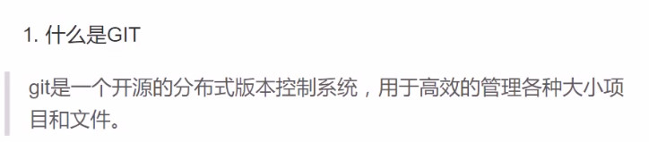


# 多线程/进程网络并发


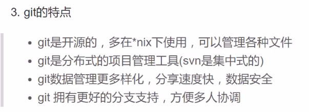

## 给予fork的多进程网络并发模型


```
"""
1.创建监听套接字
2.等待接收客户端的请求
3.客户端连接创建新的进程处理客户请求
4.原进程继续等待其他客户的连接
5.如果客户端推出，则销毁对应的进程
"""
import socket
from  socket import *
import os
import signal #处理僵尸进程
#全局变量
HOST = '0.0.0.0'
PORT = 8888
ADDR =(HOST,PORT)

#具体处理客户端请求
def handle(c):
    while True:
        data = c.recv(1024)
        if not data:
            break
        print(data.decode())
        c.send(b'ok')
    c.close()

#创建监听tcp套接字
s =socket()
s.setsockopt(SOL_SOCKET,SO_REUSEADDR)
s.bind(HOST,ADDR)
s.listen(5)

#处理僵尸进程
signal.signal(signal.SIGCHLD,signal.SIG_IGN)
print('listen the port 8888...')

while True:
    #循环处理客户端连接
    try:
        c,addr = s.accept()
        print('Connert from ',addr)
    except KeyboardInterrupt:
        os.CLD_EXITED
    except Exception as e:
        print(e)
        continue
    #创建子进程处理客户端事物
    pid = os.fork()
    if pid ==0:
        s.close()# s对handle没用，销毁掉
        handle(c)#处理具体事物
        os.CLD_EXITED #销毁子进程
    #无论父进程还是fork出凑都是要回去继续处理连接
    else:
        c.close() #父进程不需要和客户端通信,父进程就是不停的监听
```

联系：

根据fork多进程并发网咯模型思路，完成process的网路模型

```python
"""
1.创建监听套接字
2.监听套接字
3.如果有用户连过来，给客户创建新进程
4.原来的进程继续监听
5.如果客户离开，断开套接字
"""
from multiprocessing import Process
import os,signal
from socket import *
signal.signal(signal.SIGCHLD,signal.SIG_IGN)

HOST = '0.0.0.0'
PORT = 8888
ADDR =(HOST,PORT)
def handle(conn):
    s.close()
    while True:
        data= conn.recv(1024)
        print(data)
        conn.send(b'hello')
s = socket.socket(socket.AF_INET,socket.SOCK_STREAM)
s.setsockopt(socket.SOL_SOCKET,socket.SO_REUSEADDR)

s.bind(ADDR)
s.listen(5)

while True:
    try:
        conn,addr = s.accept()
        print('connect from '.addr)
    except KeyboardInterrupt:
        os.CLD_EXITED
    except Exception as e:
        print(e)
        continue
    p1 = Process(target=handle,args=(conn,))
    p1.daemon = True #父进程结束，则所有服务终止。
    p1.start()
    # p1.join() 这里不能写，写了就成了阻塞函数了，阻塞了 不能循环了
    conn.close
```


```
from threading import Thread
import os,signal
from socket import *
signal.signal(signal.SIGCHLD,signal.SIG_IGN)

HOST = '0.0.0.0'
PORT = 8888
ADDR =(HOST,PORT)
def handle(conn):
    s.close()
    while True:
        data= conn.recv(1024)
        print(data)
        conn.send(b'hello')
    conn.close
s = socket.socket(socket.AF_INET,socket.SOCK_STREAM)
s.setsockopt(socket.SOL_SOCKET,socket.SO_REUSEADDR)

s.bind(ADDR)
s.listen(5)

while True:
    try:
        conn,addr = s.accept()
        print('connect from ',addr)
    except KeyboardInterrupt:
        os.CLD_EXITED
    except Exception as e:
        print(e)
        continue
   t = Thread(target = handle, args=conn)
   t.setDaemon(True)
   t.start()
   conn.close()
```

练习 做FTP服务器

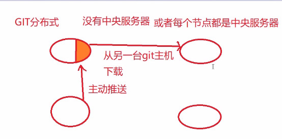

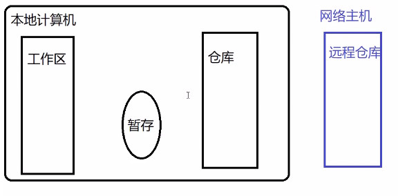


# 作业:

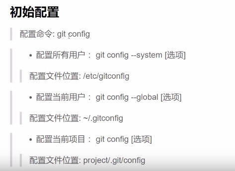

# 回顾：

1.GIL(全局解释器锁)

给解释器枷锁，在解释线程时只能解释一个线程，导致python线程效率低。

无阻塞和操作 效率低

高阻塞 效率高

2.进程，线程的区别

线程是进程的一部分

线程资源消耗低，进程效率高

线程独享进程要求

线程效率相对低

i/o并发效率低

3.并发模型

*多进程线程并发模型

每个用户进来 都为创造一个新的进程，原来的进程仍在接收新用户进来。

*io并发


forkserver

process server

thread server


# IO并发

# 在内存中存在数据交换的行为都认为是io行为

IO的特点是慢 执行效率不高 数据交换慢 和阻塞

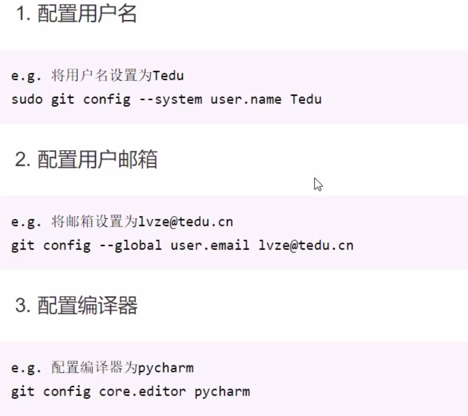

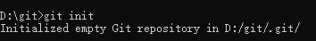

# 非阻塞

超时检测是不会和非阻塞一起使用的，在任何地方

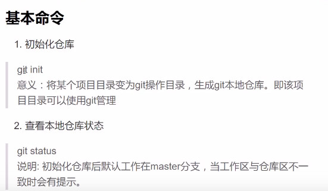


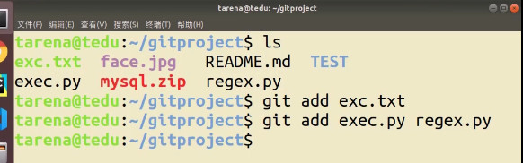

```
"""
IO阻塞
套接字非阻塞
"""
from socket import   *
from  time import  ctime,sleep
#日志文件
f = open('log.txt','a+')

# tcp套接字
s =socket()
s.bind(('0.0.0.0',8888))
s.listen(3)

#设置套接字为非阻塞
s.setblocking(False)

while True:
    print('waiting for...')
    #没有客户端连接每3秒写1条日志
    try:
        conn,addr = s.accept()
    except BlockingIOError as e:
        sleep(3)
        f.write('%s:%s\n'%(ctime(),e))
        f.flush()
    else:
        print(('connext from ')%addr)
        data =conn.recv(1023).decode()"""
IO阻塞
套接字非阻塞
"""
from socket import   *
from  time import  ctime,sleep
#日志文件
f = open('log.txt','a+')

# tcp套接字
s =socket()
s.bind(('0.0.0.0',8888))
s.listen(3)

# #设置套接字为非阻塞
# s.setblocking(False)

#设置超时检测
s.settimeout(3) #通过s调用的函数最都阻塞3秒

while True:
    print('waiting for...')
    #没有客户端连接每3秒写1条日志
    try:
        conn,addr = s.accept()
    except (BlockingIOError,TimeoutError) as e:
        sleep(3)
        f.write('%s:%s\n'%(ctime(),e))
        f.flush()
    else:
        print(('connext from ')%addr)
        data =conn.recv(1023).decode()
```


# I/O多路复用

准备就绪：操作系统已经感知到了它的发生 然后交给应用层处理。内核已经感知到发生，不可逆的行为

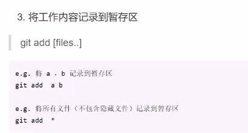


 


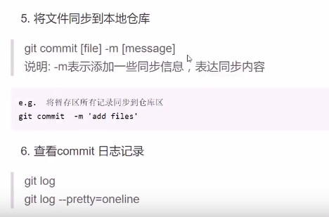

## select windows,linux,unix 阻塞函数

rlist:读事件，等待发生，不是主动控制:比如 等待客户端的连接，recv客户端消息,需要等待满足一定条件发生，不知道什么时候发生

wlist 写事件，可以主动去处理的事件，比如文件的读写，

分类存放

当select结束阻塞（timeout除外 ）有返回值的时候，三个列表返回值至少有一个不为空，select才会结束


```python
"""
select I/O多路复用
"""
from select import select
from socket import *

s =socket()
s.bind(('0.0.0.0',8888))
s.listen(3)

f = open('1.txt','r')

print('监控I/O')
rs,ws,xs = select([s],[f],[],3)
print('rlist:',rs)
print('wlist:',ws)
print('xlist',xs)
```

如何通过select实现对多个客户的监听

```python
"""
select TCP服务

思路分析：
1.将关注的IO放入到监控列表
2.当iO就绪时会通过selct返回
3.遍历返回值列表，得知哪个IO就绪进行处理
4.列表中删除不需要关注的IO
"""
from  socket import  *
from select import select
#创建监听套接字，作为关注的IO
s = socket()
s.setsockopt(SOL_SOCKET,SO_REUSEADDR,1)

s.bind(('0.0.0.0',8888))
s.listen(3)
#设置关注列表
rlist = [s]#s用处等待处理客户端的连接
wlist= []
xlist =[]
while True:
    #监控IO
    rs,ws,xs = select(rlist, wlist, xlist)
    #遍历返回值列表，处理就绪的IO
    for r in rs:
        if r is s:
            c,addr = r.accept()
            print('connext from...')
            rlist.append(c) #增加新的IO关注

        else:
            # 有客户端发消息
            data = r.recv(1024)
            if not data:
                rlist.remove(r)#移除掉线的IO
                r.close()
                continue
            print(data)
            r.sebd(b'ok')

    for w in ws:
            pass
    for x in xs:
            pass
```

```python
"""
select TCP服务

思路分析：
1.将关注的IO放入到监控列表
2.当iO就绪时会通过selct返回
3.遍历返回值列表，得知哪个IO就绪进行处理
4.列表中删除不需要关注的IO
"""
from  socket import  *
from select import select
#创建监听套接字，作为关注的IO
s = socket()
s.setsockopt(SOL_SOCKET,SO_REUSEADDR,1)

s.bind(('0.0.0.0',8888))
s.listen(3)
#设置关注列表
rlist = [s]#s用处等待处理客户端的连接
wlist= []
xlist =[]
while True:
    #监控IO
    rs,ws,xs = select(rlist, wlist, xlist)
    #遍历返回值列表，处理就绪的IO
    for r in rs:
        if r is s:
            c,addr = r.accept()
            print('connext from...',addr)
            rlist.append(c) #增加新的IO关注

        else:
            # 有客户端发消息
            data = r.recv(1024)
            if not data:
                rlist.remove(r)#移除掉线的IO
                r.close()
                continue
            print(data)
            # r.send(b'ok')
            wlist.append(r)# send是主动行为，可以加入监控

    for w in ws:
        w.send(b'ok')
        wlist.remove(w) #发送完消息就移除列表,

    for x in xs:
            pass
```


# @@扩展：位运算

&判断属性 |增加属性

真 1 假 0

&安位与 遇假则假

10001

10010

10000

|按位或 遇真则真

10001

10011

10011

^按位异或 想同为0 不同为1

10001

 11101

  01100

<<左移：向左整体移动 低位补0

1100

110000

右移 右移去掉低位


# poll方法


```python
"""
POOL
思路分析
IO多路复用实现并发
建立fileno-----> io对象字典 用于IO查找

"""
from socket import  *
from select import *

#创建监听套接字，作为关注的IO
s = socket()
s.setsockopt(SOL_SOCKET,SO_REUSEADDR,1)
s.bind(('0.0.0.0',8888))
s.listen(3)

#创建poll对象
p = poll()
#建立查找字典，通过一个IO的fileno找到 IO对象
#始终跟register的io保持一致
fdmap ={s.fileno():s}

#关注s
p.register(s,POLLIN|POLLOUT)

#循环解控IO发生
while True:
    events = p.poll()
    print(events)
    #循环遍历列表，查看哪个IO就绪，进行处理
    for fd,event in events:
        # print('flieno',fd)
        # print('event',event)
        if fd== s.fileno():
            c,addr = fdmap[fd].accept()
            print('connect from',addr)
            #关注客户端连接套接字
            p.register(c,POLLIN|POLLERR)
            fdmap[c.fileno()]=c#维护字典
        elif event & POLLIN: #判断是否为POLLIN就绪
                data = fdmap[fd].recv(1024)
                if not data:
                    p.unregister(fd)#取消关注
                    fdmap[fd].close()
                    del fdmap[fd] #从字典删除
                    continue
                print(data)
                fdmap[fd].send(b'ok')
```

# eploll


```python
"""
epool
思路分析
IO多路复用实现并发
建立fileno-----> io对象字典 用于IO查找

"""
from socket import  *
from select import *

#创建监听套接字，作为关注的IO
s = socket()
s.setsockopt(SOL_SOCKET,SO_REUSEADDR,1)
s.bind(('0.0.0.0',8888))
s.listen(3)

#创建epoll对象
p = epoll()
#建立查找字典，通过一个IO的fileno找到 IO对象
#始终跟register的io保持一致
fdmap ={s.fileno():s}

#关注s
p.register(s,WPOLLIN|WPOLLOUT)

#循环解控IO发生
while True:
    events = p.poll()
    print(events)
    #循环遍历列表，查看哪个IO就绪，进行处理
    for fd,event in events:
        # print('flieno',fd)
        # print('event',event)
        if fd== s.fileno():
            c,addr = fdmap[fd].accept()
            print('connect from',addr)
            #关注客户端连接套接字
            p.register(c,EPOLLIN|EPOLLERR)
            fdmap[c.fileno()]=c#维护字典
        elif event &WPOLLIN: #判断是否为EPOLLIN就绪
                data = fdmap[fd].recv(1024)
                if not data:
                    p.unregister(fd)#取消关注
                    fdmap[fd].close()
                    del fdmap[fd] #从字典删除
                    continue
                print(data)
                fdmap[fd].send(b'ok')
```

# select poll epoll总结

select poll epoll都是在应用层筹集我们摇关注的IO,然后交由内核帮我们监控处理，如果内核处理wan完了，给我们应用层返回，返回之后再由应用层去具体处理IO发生的事件

IO多路复用是一种资源消耗很少，比较高效的方法。

select最全面 3个系统都支持 支持1024 连接 早

poll支持linux,unix

epoll 支持unix 晚 效率最高 监控数量最高


poll可以连续祖册，连续注册是吧之前的自动删除，再添加

epoll省去每次了拷贝和遍历的过程,epoll不允许两次注册，必须取消前次注册，才能再主次


水平触发：当操作系统某个io就绪，没处理的话 会一直提醒

边缘触发：不会一直提醒，io没处理这次就不处理了，下次再说。


# 回顾：

1.IO模型：IO通信的不同模式

阻塞 非阻塞，IO多路复用

*阻塞IO：默认行为，简单 效率低，实现简单

​	遇到阻塞函数，传输速度慢

*非阻塞 IO:通过属性的修改，一定程度上提高了效率

​		block timeout

2.IO多路复用

利用计算机内核同时监控多个IO行为，哪个IO就绪了，可以在应用层执行了，进行返回，返回后通过具体的方法执行这个IO

select：

​	优点:	支持windows,unix,linux

​	缺点:	效率相对epoll一般，最多监控1024io

poll 

​	 优点：支持linux,unix，支持更多的IO

​	 缺点：效率相对epoll一般，

epoll

​	 优点：效率高 有更多的触发方式

​		直接在内存空间开辟监控描述符，触发方式选择更多，不用描述符来回跑位。

​	缺点：只支持linux